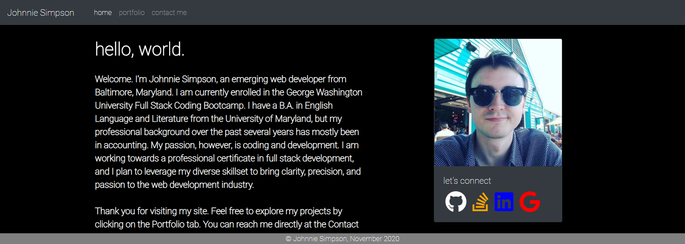
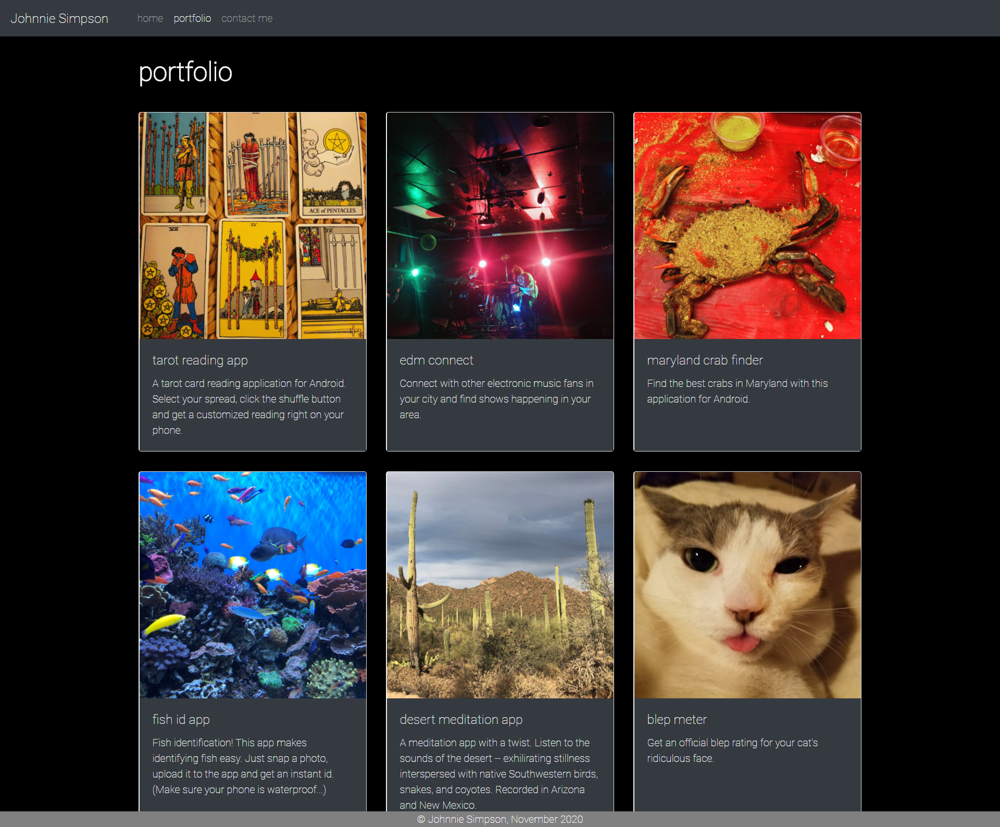
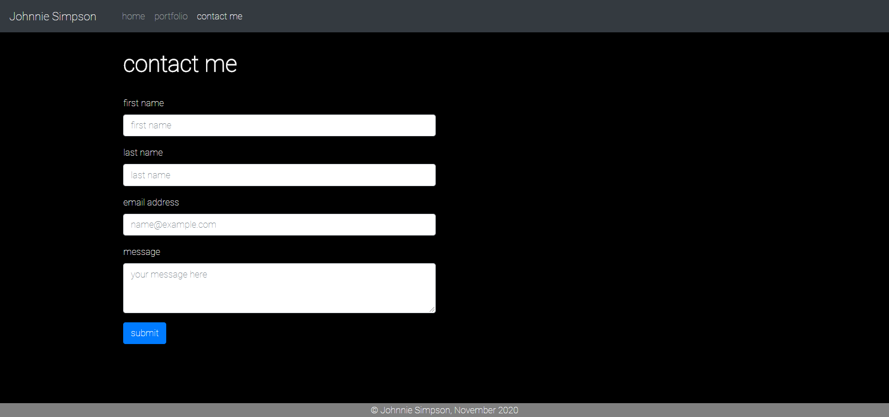

# Portfolio-Responsive
A responsive portfolio to document projects and provide personal details and contact info.

Second assignment for George Washington University Full Stack Coding Bootcamp.

Primary goal: Create a Developer Portfolio website using Bootstrap framework, with minimal media queries.

Deployed application: https://balokdecoy.github.io/Portfolio-Responsive/

Repo: https://github.com/balokdecoy/Portfolio-Responsive

Screenshots: 

